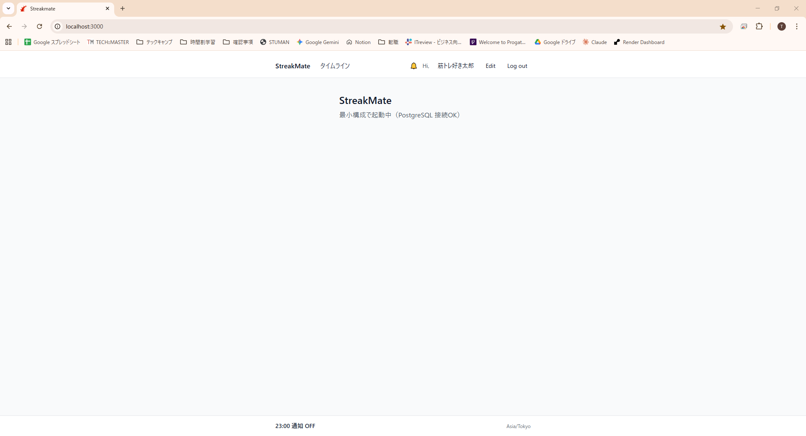
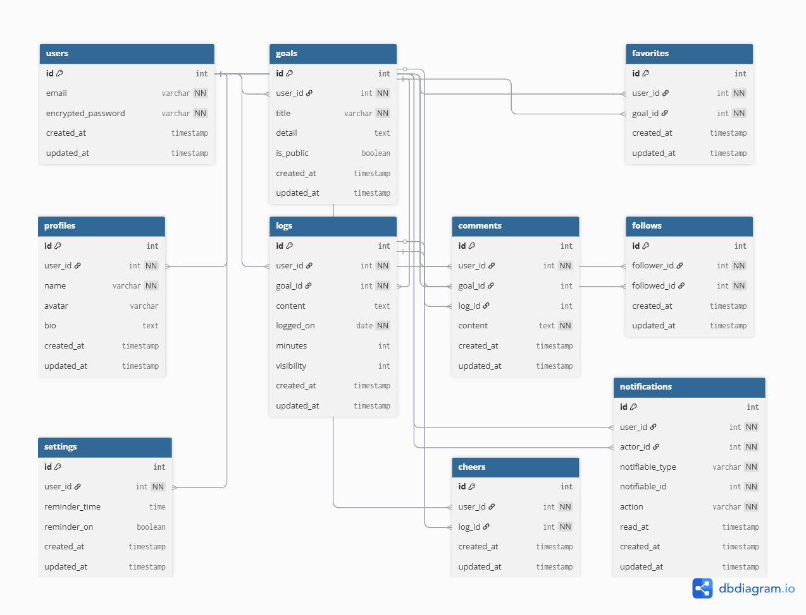

# StreakMate

> 習慣の「連続記録（Streak）」を、仲間（Mate）と応援し合いながら積み上げる習慣化アプリ。モバイルファーストで、まずは**自分の進捗可視化と簡単投稿**を最優先に MVP を構築しています。

<div align="center">
  

  
*Mobile*
  


</div>

---

## ✨ 特長
- **最小摩擦の記録**：今日/今週の記録を最短操作で追加
- **可視化**：月/週の積み上げをグラフで俯瞰（時間・件数）
- **ソーシャル**：フォロー、応援（👍）、コメント、通知（段階導入）

---

## 🧱 技術スタック
- **Framework**: Ruby on Rails 7
- **DB**: PostgreSQL
- **Auth**: Devise（予定/導入済に合わせて明記）
- **UI**: Tailwind CSS
- **Job/Async**: ActiveJob + (Adapter TBD)
- **Infra**: Render（本番予定）
- **Others**: Turbo/Stimulus（必要に応じて）

---

## 📱 モバイルファーストの意図
最も利用頻度の高いシーン（外出中・スキマ時間）で「**すぐ開いて、すぐ記録**」を実現するため、**モバイル幅**での**速度/視認性/タップ性**を最優先に設計。PC ではダッシュボードや振り返り分析を拡張していきます。

---

## 🗺️ ロードマップ（抜粋）
- **MVP（現行）**：ログ投稿・今日/今週ビュー・基本グラフ・簡易通知
- **v1**：フォロー/応援/コメントの安定化、公開範囲、プロフィール
- **v1.1**：月間サマリー、目標別の時間/件数グラフ
- **v2**：他ユーザーの進捗タイムライン、検索/フィルタ
- **v2.1**：リマインダー高度化（曜日/時間帯）、OGP 共有

> 詳細は Issues / Projects を参照

---

## 🛠️ ローカル開発

### 前提
- Ruby / Bundler
- PostgreSQL（ローカル）
- Node.js + Yarn（または npm）
- （Tailwind を監視する場合）`@rails/tailwindcss` 導入済

### 1) クローン & セットアップ
```bash
git clone <YOUR-REPO-URL>
cd streakmate
bin/setup


> `bin/setup` が以下を実行します：
>
> * `bundle install` / `yarn install`
> * `.env` 不在なら `.env.example` から作成
> * `bin/rails db:prepare`（create/migrate）
> * `bin/rails db:seed`（任意）

### 2) 起動

```bash
bin/dev
# => foreman/overmind があれば Procfile.dev で web/css を並行起動
# => 無い場合は Rails サーバのみ起動
```

アクセス: [http://localhost:\${APP\_PORT:-3000}](http://localhost:${APP_PORT:-3000}) （デフォルトは 3000）

---

## 🔐 環境変数

開発では `.env` で読み込みます（**鍵は絶対にコミットしない**）:

```
# 例: .env (値は自分の環境に合わせて設定)
APP_NAME=StreakMate
APP_HOST=localhost
APP_PORT=3000
DB_HOST=localhost
DB_USER=postgres
DB_PASSWORD=
DB_NAME=streakmate_development
DB_TEST=streakmate_test
```

> 参考ファイル: `.env.example`
> **Render や本番の手順/環境変数は、デプロイ先の公式ドキュメントを参照してください。**
>
> * データベース接続例: `DATABASE_URL`
> * 資格情報: `RAILS_MASTER_KEY`（Rails credentials 使用時）
> * サードパーティ鍵（PayJP 等）は**環境変数**で設定し、README には**値を記載しません**。

---

## 🗃️ ER 図 / テーブル設計

### ER 図



### users

| Column   | Type   | Options                   |
| -------- | ------ | ------------------------- |
| email    | string | null: false, unique: true |
| password | string | null: false               |

**Association**

* has\_one \:profile
* has\_many \:goals
* has\_many \:logs
* has\_many \:cheers
* has\_many \:comments
* has\_many \:follows
* has\_many \:favorites
* has\_many \:notifications
* has\_one \:setting

### profiles

| Column   | Type       | Options                         |
| -------- | ---------- | ------------------------------- |
| user\_id | references | null: false, foreign\_key: true |
| name     | string     | null: false                     |
| avatar   | string     |                                 |
| bio      | text       |                                 |

**Association**

* belongs\_to \:user

### goals

| Column     | Type       | Options                         |
| ---------- | ---------- | ------------------------------- |
| user\_id   | references | null: false, foreign\_key: true |
| title      | string     | null: false                     |
| detail     | text       |                                 |
| is\_public | boolean    | default: true                   |

**Association**

* belongs\_to \:user
* has\_many \:logs
* has\_many \:comments
* has\_many \:favorites

### logs

| Column     | Type       | Options                         |
| ---------- | ---------- | ------------------------------- |
| user\_id   | references | null: false, foreign\_key: true |
| goal\_id   | references | null: false, foreign\_key: true |
| content    | text       |                                 |
| logged\_on | date       | null: false                     |

**Association**

* belongs\_to \:user
* belongs\_to \:goal
* has\_many \:cheers
* has\_many \:comments

### cheers（いいね）

| Column   | Type       | Options                         |
| -------- | ---------- | ------------------------------- |
| user\_id | references | null: false, foreign\_key: true |
| log\_id  | references | null: false, foreign\_key: true |

**Association**

* belongs\_to \:user
* belongs\_to \:log
* add\_index \[:user\_id, \:log\_id], unique: true

### comments

| Column   | Type       | Options                         |
| -------- | ---------- | ------------------------------- |
| user\_id | references | null: false, foreign\_key: true |
| goal\_id | references | foreign\_key: true              |
| log\_id  | references | foreign\_key: true              |
| content  | text       | null: false                     |

**Association**

* belongs\_to \:user
* belongs\_to \:goal, optional: true
* belongs\_to \:log, optional: true

### follows（自己参照）

| Column       | Type       | Options                                         |
| ------------ | ---------- | ----------------------------------------------- |
| follower\_id | references | null: false, foreign\_key: { to\_table: users } |
| followed\_id | references | null: false, foreign\_key: { to\_table: users } |

**Association**

* belongs\_to \:follower, class\_name: "User"
* belongs\_to \:followed, class\_name: "User"
* add\_index \[:follower\_id, \:followed\_id], unique: true

### favorites

| Column   | Type       | Options                         |
| -------- | ---------- | ------------------------------- |
| user\_id | references | null: false, foreign\_key: true |
| goal\_id | references | null: false, foreign\_key: true |

**Association**

* belongs\_to \:user
* belongs\_to \:goal
* add\_index \[:user\_id, \:goal\_id], unique: true

### notifications

| Column   | Type       | Options                         |
| -------- | ---------- | ------------------------------- |
| user\_id | references | null: false, foreign\_key: true |
| message  | string     | null: false                     |
| read     | boolean    | default: false                  |

**Association**

* belongs\_to \:user

### settings

| Column         | Type       | Options                         |
| -------------- | ---------- | ------------------------------- |
| user\_id       | references | null: false, foreign\_key: true |
| reminder\_time | time       | default: '23:00'                |
| reminder\_on   | boolean    | default: true                   |

**Association**

* belongs\_to \:user

---

## 🗃️ Database Schema


For full table definitions, see [docs/db_design.md](docs/db_design.md).

---

## 🧪 テスト / リント（任意）

```bash
bin/rails test      # or rspec
bundle exec rubocop
```

---

## 🚀 デプロイ（Render）

* Render の **公式ドキュメント**に従い、以下を環境変数で設定します：

  * `RAILS_MASTER_KEY` / `DATABASE_URL` / その他キー
* 本リポジトリでは **鍵値は管理しません**。**リンク先ガイドで各自設定**してください。

---

## 📝 ライセンス

* TBD
